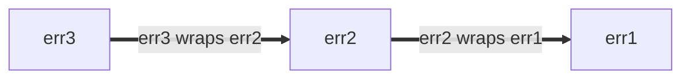

## Error handling

### Placement of %w in errors

Prefer to place `%w` at the end of an error string *if* you are to use
[error wrapping](https://go.dev/blog/go1.13-errors) with the `%w` formatting
verb.

Errors can be wrapped with the `%w` verb, or by placing them in a
[structured error](https://google.github.io/styleguide/go/index.html#gotip) that
implements `Unwrap() error` (ex:
[`fs.PathError`](https://pkg.go.dev/io/fs#PathError)).

Wrapped errors form error chains: each new layer of wrapping adds a new entry to
the front of the error chain. The error chain can be traversed with the
`Unwrap() error` method. For example:

```go
err1 := fmt.Errorf("err1")
err2 := fmt.Errorf("err2: %w", err1)
err3 := fmt.Errorf("err3: %w", err2)
```

This forms an error chain of the form,



Regardless of where the `%w` verb is placed, the error returned always
represents the front of the error chain, and the `%w` is the next child.
Similarly, `Unwrap() error` always traverses the error chain from newest to
oldest error.

Placement of the `%w` verb does, however, affect whether the error chain is
printed newest to oldest, oldest to newest, or neither:

```go
// Good:
err1 := fmt.Errorf("err1")
err2 := fmt.Errorf("err2: %w", err1)
err3 := fmt.Errorf("err3: %w", err2)
fmt.Println(err3) // err3: err2: err1
// err3 is a newest-to-oldest error chain, that prints newest-to-oldest.
```

```go
// Bad:
err1 := fmt.Errorf("err1")
err2 := fmt.Errorf("%w: err2", err1)
err3 := fmt.Errorf("%w: err3", err2)
fmt.Println(err3) // err1: err2: err3
// err3 is a newest-to-oldest error chain, that prints oldest-to-newest.
```

```go
// Bad:
err1 := fmt.Errorf("err1")
err2 := fmt.Errorf("err2-1 %w err2-2", err1)
err3 := fmt.Errorf("err3-1 %w err3-2", err2)
fmt.Println(err3) // err3-1 err2-1 err1 err2-2 err3-2
// err3 is a newest-to-oldest error chain, that neither prints newest-to-oldest
// nor oldest-to-newest.
```

Therefore, in order for error text to mirror error chain structure, prefer
placing the `%w` verb at the end with the form `[...]: %w`.

<a id="error-percent-w-sentinel-placement"></a>

#### Sentinel error placement

An exception to this rule is when wrapping sentinel errors. A sentinel error is
an error that serves as a primary categorization of a failure. This helps
observers quickly understand the nature of a failure (such as "not found" or
"invalid argument") without having to parse the entire error message.
Identifying that error type as early as possible in the error string is
beneficial.

Examples of sentinel errors include os errors (e.g., [`os.ErrInvalid`]) and
package-level errors.

In these cases, placing the `%w` verb at the beginning of the error string can
improve readability by immediately identifying the category of the error.

```go
// Good:
package parser

var ErrParse = fmt.Errorf("parse error")

// This is another package error that could be returned.
var ErrParseInvalidHeader = fmt.Errorf("%w: invalid header", ErrParse)

func parseHeader() error {
  err := checkHeader()
  return fmt.Errorf("%w: invalid character in header: %v", ErrParseInvalidHeader, err)
}

err := fmt.Errorf("%w: couldn't find fortune database: %v", ErrInternal, err)
```

Placing the status at the beginning ensures that the most relevant categorical
information is most prominent.

```go
// Bad:
package parser

var ErrParse = fmt.Errorf("parse error")

// This is another package error that could be returned.
var ErrParseInvalidHeader = fmt.Errorf("%w: invalid header", ErrParse)

func parseHeader() error {
  err := checkHeader()
  return fmt.Errorf("invalid character in header: %v: %w", err, ErrParseInvalidHeader)
}

var ErrInternal = status.Error(codes.Internal, "internal")
err2 := fmt.Errorf("couldn't find fortune database: %v: %w", err, ErrInternal)
```

When you place it at the end, it makes it harder to identify the error category
when reading the error text, as it's buried in the specific error details.

[`os.ErrInvalid`]: https://pkg.go.dev/os#ErrInvalid

See also:

*   [Go Tip #48: Error Sentinel Values]
*   [Go Tip #106: Error Naming Conventions]

[commentary]: decisions#commentary
[Go Tip #48: Error Sentinel Values]: https://google.github.io/styleguide/go/index.html#gotip
[Go Tip #106: Error Naming Conventions]: https://google.github.io/styleguide/go/index.html#gotip

<a id="error-logging"></a>
