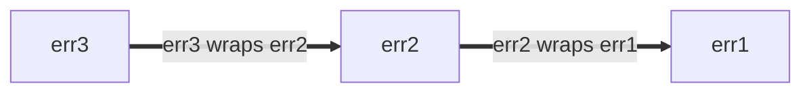

### Placement of %w in errors

Prefer to place `%w` at the end of an error string *if* you are to use
[error wrapping](https://go.dev/blog/go1.13-errors) with the `%w` formatting
verb.

Errors can be wrapped with the `%w` verb, or by placing them in a
[structured error](https://google.github.io/styleguide/go/index.html#gotip) that
implements `Unwrap() error` (ex:
[`fs.PathError`](https://pkg.go.dev/io/fs#PathError)).

Wrapped errors form error chains: each new layer of wrapping adds a new entry to
the front of the error chain. The error chain can be traversed with the
`Unwrap() error` method. For example:

```go
err1 := fmt.Errorf("err1")
err2 := fmt.Errorf("err2: %w", err1)
err3 := fmt.Errorf("err3: %w", err2)
```

This forms an error chain of the form,



Regardless of where the `%w` verb is placed, the error returned always
represents the front of the error chain, and the `%w` is the next child.
Similarly, `Unwrap() error` always traverses the error chain from newest to
oldest error.

Placement of the `%w` verb does, however, affect whether the error chain is
printed newest to oldest, oldest to newest, or neither:

```go
// Good:
err1 := fmt.Errorf("err1")
err2 := fmt.Errorf("err2: %w", err1)
err3 := fmt.Errorf("err3: %w", err2)
fmt.Println(err3) // err3: err2: err1
// err3 is a newest-to-oldest error chain, that prints newest-to-oldest.
```

```go
// Bad:
err1 := fmt.Errorf("err1")
err2 := fmt.Errorf("%w: err2", err1)
err3 := fmt.Errorf("%w: err3", err2)
fmt.Println(err3) // err1: err2: err3
// err3 is a newest-to-oldest error chain, that prints oldest-to-newest.
```

```go
// Bad:
err1 := fmt.Errorf("err1")
err2 := fmt.Errorf("err2-1 %w err2-2", err1)
err3 := fmt.Errorf("err3-1 %w err3-2", err2)
fmt.Println(err3) // err3-1 err2-1 err1 err2-2 err3-2
// err3 is a newest-to-oldest error chain, that neither prints newest-to-oldest
// nor oldest-to-newest.
```

Therefore, in order for error text to mirror error chain structure, prefer
placing the `%w` verb at the end with the form `[...]: %w`.

<a id="error-percent-w-sentinel-placement"></a>
